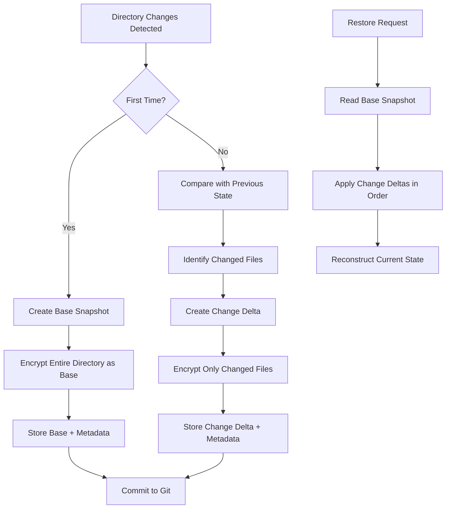

# git-vault

A secure directory encryption tool for Git repositories that uses AES-256/GCM encryption to protect sensitive directories.

## Quick Start (One-Liner Installation)

Install git-vault in your repository with a single command:

```bash
curl -fsSL https://raw.githubusercontent.com/benjaminpreiss/git-vault/main/install.sh | bash
```

Or specify a custom installation directory:

```bash
curl -fsSL https://raw.githubusercontent.com/benjaminpreiss/git-vault/main/install.sh | bash -s -- --dir my-vault
```

This will:

-   Download git-vault scripts to `.git-vault/` (or your specified directory)
-   Create `.git-vault-dirs` configuration file
-   Set up automatic `.gitignore` entries
-   Install a pre-commit hook for automatic encryption
-   Create a `./git-vault` wrapper script for easy access

## Overview

git-vault allows you to encrypt and decrypt specific directories within a Git repository using a configuration-based approach. Instead of hardcoding directory paths, you specify which directories to encrypt in a `.git-vault-dirs` configuration file.

## Manual Setup

If you prefer manual installation:

### 1. Download Files

Download the scripts to your preferred directory (default: `.git-vault/`):

-   `locker.sh` - Main encryption/decryption script
-   `encrypt_decrypt.sh` - Core encryption functionality

### 2. Configuration File (Auto-Generated)

The `.git-vault-dirs` configuration file is automatically created in your Git repository root:

```
# git-vault directories configuration
# Add one directory path per line (relative to git repository root)
# Lines starting with # are comments and will be ignored
#
# Example:
# secrets
# private
# config/sensitive
```

Add your directory paths to encrypt (one per line):

```
secrets
private
config/sensitive
```

Directory paths should be relative to your Git repository root. Lines starting with `#` are treated as comments.

### 3. Environment File (Auto-Generated)

The encryption key is automatically generated and stored in `.git-vault.env` in your repository root when you run your first lock operation.

**Important**:

-   The `.git-vault.env` file is automatically added to `.gitignore`
-   Secret directories are automatically added to `.gitignore` to prevent committing unencrypted data
-   Encrypted files (`.nonce` and `.tar.gz.aes256gcm.enc`) are explicitly included in Git via gitignore exceptions
-   Keep your `.git-vault.env` file secure and backed up separately from your repository

**Gitignore Pattern Example:**

```
# Added by git-vault for secrets
secrets/*
```

**Note**: Encrypted files are stored in `.git-vault/data/` directory with the same path structure as your original directories, so they don't conflict with gitignore patterns for secret directories.

## Usage

### Using the Wrapper Script

After installation, use the convenient wrapper:

```bash
./git-vault lock    # Encrypt directories
./git-vault unlock  # Decrypt directories
```

### Direct Script Usage

Or call the scripts directly:

```bash
./.git-vault/locker.sh lock
./.git-vault/locker.sh unlock
```

### Lock (Encrypt) Directories

```bash
./git-vault lock
```

This will:

-   Read directories from `.git-vault-dirs`
-   Encrypt each directory specified in the configuration
-   Create `.tar.gz.aes256gcm.enc` and `.nonce` files for each directory

### Unlock (Decrypt) Directories

```bash
./git-vault unlock
```

This will:

-   Read directories from `.git-vault-dirs`
-   Decrypt each directory using the corresponding encrypted files
-   Restore the original directory contents

## Automatic Pre-Commit Hook

The installation automatically sets up a pre-commit hook that:

-   Runs `git-vault lock` before each commit
-   Stages encrypted files automatically
-   Prevents commits if encryption fails

**Existing Pre-Commit Hooks:**
If you already have a pre-commit hook, git-vault will:

-   Create a backup of your existing hook (`.git/hooks/pre-commit.backup`)
-   Append git-vault functionality to your existing hook
-   Preserve all existing pre-commit functionality

This ensures your sensitive directories are always encrypted before being committed to Git while maintaining compatibility with existing workflows.

## Files Structure

After installation, your repository will contain:

```
your-repo/
├── .git-vault/              # git-vault installation directory
│   ├── locker.sh           # Main script
│   └── encrypt_decrypt.sh  # Core encryption functionality
├── .git-vault/data/         # Encrypted files storage (mirrors directory structure)
│   ├── secrets.tar.gz.aes256gcm.enc
│   ├── secrets.nonce
│   ├── config/
│   │   ├── sensitive.tar.gz.aes256gcm.enc
│   │   └── sensitive.nonce
│   └── public/
│       ├── artworks.tar.gz.aes256gcm.enc
│       └── artworks.nonce
├── git-vault               # Wrapper script for easy access
├── .git-vault-dirs         # Configuration file
├── .git-vault.env          # Environment file (auto-generated, not committed)
├── .gitignore              # Updated with git-vault entries
└── .git/hooks/pre-commit   # Auto-encryption hook
```

## Security Features

-   **AES-256/GCM encryption** - Industry-standard authenticated encryption
-   **Random nonces** - Each encryption uses a unique 96-bit nonce
-   **Key validation** - Ensures proper 256-bit hexadecimal key format
-   **Git integration** - Automatically finds Git repository root
-   **Configuration-based** - Flexible directory specification via plain text
-   **Automatic gitignore** - Prevents accidental key commits

## Encrypted File Storage

git-vault stores encrypted files in the `.git-vault/data/` directory, preserving the exact directory structure of your original files:

### Directory Structure Examples

```
Original directories:          Encrypted storage:
├── secrets/                  ├── .git-vault/data/secrets.tar.gz.aes256gcm.enc
├── private/                  ├── .git-vault/data/secrets.nonce
├── config/sensitive/         ├── .git-vault/data/private.tar.gz.aes256gcm.enc
└── public/artworks/          ├── .git-vault/data/private.nonce
                              ├── .git-vault/data/config/sensitive.tar.gz.aes256gcm.enc
                              ├── .git-vault/data/config/sensitive.nonce
                              ├── .git-vault/data/public/artworks.tar.gz.aes256gcm.enc
                              └── .git-vault/data/public/artworks.nonce
```

### Key Benefits

-   **No naming conflicts**: `config/sensitive` and `public/sensitive` are stored separately
-   **Intuitive organization**: Encrypted files mirror your directory structure
-   **Git-friendly**: All encrypted files are in one location (`.git-vault/data/`)
-   **Clean separation**: Original directories remain untouched during encryption

## Requirements

-   Bash shell
-   Git
-   Botan cryptography library (Botan 3 recommended)
-   Standard Unix tools (tar, sed, grep, etc.)
-   curl or wget (for installation)

## Example Workflow

1. **Install**: Run the one-liner installation command
2. **Configure**: Edit `.git-vault-dirs` to specify directories to encrypt
3. **Encrypt**: Run `./git-vault lock` to encrypt directories
4. **Commit**: Git commits will automatically encrypt directories via pre-commit hook
5. **Decrypt**: Run `./git-vault unlock` when you need to work with decrypted files

## Advanced Usage

### Custom Installation Directory

```bash
curl -fsSL https://raw.githubusercontent.com/benjaminpreiss/git-vault/main/install.sh | bash -s -- --dir custom-vault-dir
```

### Manual Key Management

If you need to manually manage your encryption key:

```bash
# Generate a new key
botan rng --format=hex 32

# Add to .git-vault.env
echo "GIT_VAULT_PASS=your-generated-key" > .git-vault.env
```

### Disable Pre-Commit Hook

To temporarily disable automatic encryption:

```bash
chmod -x .git/hooks/pre-commit
```

Re-enable with:

```bash
chmod +x .git/hooks/pre-commit
```

## Notes

-   **Encrypted files are stored in `.git-vault/data/`** with the same directory structure as your original directories
-   **Path structure preservation**: `public/artworks` → `.git-vault/data/public/artworks.tar.gz.aes256gcm.enc`
-   **No naming conflicts**: Nested directories with same basename (e.g., `config/sensitive` and `public/sensitive`) are handled correctly
-   The tool works from the Git repository root, regardless of where scripts are located
-   Directory paths in `.git-vault-dirs` are always relative to the Git repository root
-   The pre-commit hook ensures you never accidentally commit unencrypted sensitive data
-   Original directories remain in place during locking - only encrypted copies are created

## Troubleshooting

### Installation Issues

If the one-liner installation fails:

1. Ensure you're in a Git repository
2. Check that curl or wget is available
3. Verify internet connectivity
4. Try manual installation instead

### Encryption Issues

If encryption fails:

1. Verify Botan is installed: `botan version`
2. Check that directories in `.git-vault-dirs` exist
3. Ensure you have write permissions in the repository
4. Check `.git-vault.env` file exists and contains valid key

### Pre-Commit Hook Issues

If commits are being blocked:

1. Check that `./git-vault lock` runs successfully
2. Verify all directories in `.git-vault-dirs` exist
3. Temporarily disable hook if needed: `chmod -x .git/hooks/pre-commit`

**Existing Hook Conflicts:**

If you have issues with existing pre-commit hooks:

1. Check if backup was created: `ls -la .git/hooks/pre-commit.backup`
2. Restore original hook: `mv .git/hooks/pre-commit.backup .git/hooks/pre-commit`
3. Manually integrate git-vault by adding the encryption call to your existing hook
4. Re-run setup to append git-vault functionality again

**Manual Integration:**
Add this to your existing pre-commit hook:

```bash
# git-vault integration
"$(git rev-parse --show-toplevel)/.git-vault/locker.sh" lock || exit 1
```

## Testing with Docker

git-vault includes a comprehensive Docker testing environment for safe testing and development.

### Quick Test

Run the automated test suite:

```bash
./test-docker.sh test
```

### Interactive Testing

Start an interactive testing environment:

```bash
./test-docker.sh interactive
```

### Available Test Commands

```bash
./test-docker.sh test        # Run automated test suite
./test-docker.sh interactive # Start interactive shell
./test-docker.sh build       # Build Docker image only
./test-docker.sh clean       # Clean up Docker resources
./test-docker.sh help        # Show help
```

### Test Environment Details

The Docker test environment includes:

-   **Alpine Linux** base image with Botan 3
-   **All dependencies** pre-installed (bash, git, botan3, etc.)
-   **Non-root user** for realistic testing
-   **Isolated environment** safe for testing
-   **Automated test suite** covering all functionality
-   **Cross-platform compatibility** testing

### Manual Testing Steps

In the interactive environment, you can manually test:

```bash
# 1. Create a test repository
mkdir test-project && cd test-project
git init

# 2. Install git-vault
bash /home/testuser/git-vault-source/setup.sh

# 3. Create test data
mkdir secrets
echo "api-key=secret123" > secrets/config.env

# 4. Configure git-vault
echo "secrets" > .git-vault-dirs

# 5. Test encryption
./git-vault lock

# 6. Test decryption
./git-vault unlock

# 7. Test git integration
git add . && git commit -m "Test commit"
```

### Test Coverage

The automated tests verify:

-   ✅ **Installation process** (setup.sh)
-   ✅ **Configuration creation** (.git-vault-dirs)
-   ✅ **Key generation** (.git-vault.env)
-   ✅ **Directory encryption** (lock operation)
-   ✅ **Directory decryption** (unlock operation)
-   ✅ **Git integration** (gitignore patterns)
-   ✅ **Pre-commit hooks** (automatic encryption)
-   ✅ **File staging** (encrypted files added to git)

### Requirements for Testing

-   Docker
-   Docker Compose
-   Bash (for test script)

### Troubleshooting Tests

If tests fail:

1. **Check Docker**: Ensure Docker daemon is running
2. **Check permissions**: Ensure test-docker.sh is executable
3. **Clean environment**: Run `./test-docker.sh clean` and retry
4. **View logs**: Docker will show detailed error output

## Planned Architecture: Incremental Change-Based Encryption

### Problem Statement

The current git-vault system re-encrypts entire directories with fresh nonces on each commit, causing unnecessary repository growth when dealing with large files. Even small changes to a single file within a vault result in the entire directory being re-encrypted and stored, leading to significant storage overhead over time.

### Solution: Incremental Change Tracking

git-vault will introduce an **incremental change-based encryption system** that tracks and encrypts only the files that have actually changed between commits, dramatically reducing repository growth while maintaining the same security guarantees.

### Architecture Overview



### Core Components

#### 1. Change Detection Engine

-   **Simple file comparison**: Modification time and file size to detect changes quickly
-   **Content verification**: SHA-256 hash only when timestamp/size indicate potential changes
-   **Metadata preservation**: File permissions, ownership, and attributes

#### 2. Incremental Storage Format

```
.git-vault/data/
├── <directory>/
│   ├── base.tar.gz.aes256gcm.enc     # Initial complete snapshot
│   ├── base.nonce                    # Base snapshot nonce
│   ├── changes/
│   │   ├── 001.delta.aes256gcm.enc   # First change set (multiple files)
│   │   ├── 001.nonce                 # Change set nonce
│   │   ├── 002.delta.aes256gcm.enc   # Second change set (multiple files)
│   │   ├── 002.nonce                 # Change set nonce
│   │   └── 003.delta.aes256gcm.enc   # Third change set (multiple files)
│   │   └── 003.nonce                 # Change set nonce
│   └── current.state                 # Current file list and metadata
```

#### 3. Change Delta Structure

**Each delta file contains ALL changes from a single commit**, packaged as a tar.gz archive:

-   **Multiple changed files**: All files modified in one commit
-   **File operations**: Added, modified, or deleted files
-   **Metadata**: Permissions, timestamps, and file attributes
-   **Change manifest**: Encrypted list of what changed (for integrity verification)

**Why manifests are essential:**

-   **Integrity verification**: Detect tampering or corruption during restoration
-   **Efficient restoration**: Know which files to expect without decrypting entire delta
-   **Security**: Prevent malicious file injection by validating expected file list
-   **Rollback capability**: Understand what each change contains for selective restoration

#### 4. Restoration Process

1. **Load base snapshot**: Decrypt and extract the initial state
2. **Apply changes sequentially**: Process each change delta in chronological order
3. **Handle conflicts**: Later changes override earlier ones for the same file
4. **Verify integrity**: Check final state against current index
5. **Restore metadata**: Apply correct permissions and timestamps

### Security Considerations

#### Encryption Strategy

-   **Unique nonces per change**: Each change delta uses a fresh 96-bit nonce
-   **Same key derivation**: Maintains current AES-256/GCM encryption
-   **Authenticated encryption**: Each change delta includes authentication tags
-   **Metadata protection**: File lists and manifests are also encrypted

#### Attack Resistance

-   **No nonce reuse**: Each change gets a cryptographically random nonce
-   **Tamper detection**: GCM authentication prevents unauthorized modifications
-   **Rollback protection**: Change sequence numbers prevent replay attacks
-   **Key isolation**: Same master key, but unique nonces maintain semantic security

### Performance Benefits

#### Storage Efficiency

-   **Reduced growth**: Only changed files contribute to repository size
-   **Compression benefits**: Similar files across changes compress better
-   **Deduplication friendly**: Git can deduplicate unchanged encrypted blocks
-   **Scalable**: Growth rate proportional to actual changes, not vault size

#### Operation Speed

-   **Faster encryption**: Only process files that actually changed
-   **Incremental backup**: Natural fit for backup and sync workflows
-   **Selective restoration**: Option to restore specific change ranges
-   **Parallel processing**: Independent change deltas can be processed concurrently

### Implementation Strategy

#### Phase 1: Core Change Detection

-   Implement file comparison engine (mtime, size, hash verification)
-   Create change delta generation logic
-   Develop base snapshot creation
-   Build restoration algorithm

#### Phase 2: Storage Format

-   Implement incremental storage format
-   Add compression for change deltas
-   Create encrypted manifest system
-   Add integrity verification tools

#### Phase 3: Advanced Features

-   Selective file restoration
-   Change history browsing
-   Performance monitoring and optimization
-   Storage analytics and reporting

### Configuration Options

#### Environment Variables

```bash
# Maximum files per delta (optional optimization)
export GIT_VAULT_MAX_FILES_PER_DELTA=100

# Compression level for deltas
export GIT_VAULT_COMPRESSION_LEVEL=6
```

### Use Cases and Benefits

#### Large Asset Repositories

-   **Media files**: Images, videos, audio files with occasional updates
-   **Binary assets**: Game assets, design files, compiled binaries
-   **Documentation**: Large document sets with incremental updates
-   **Datasets**: Scientific data, logs, and analytical datasets

#### Development Workflows

-   **Configuration management**: Environment-specific configs with small changes
-   **Secret rotation**: API keys and certificates with periodic updates
-   **Dependency caching**: Package caches with incremental additions
-   **Build artifacts**: Compiled outputs with incremental builds

### Monitoring and Diagnostics

#### Storage Analytics

```bash
# Show vault storage efficiency
./git-vault stats

# Example output:
# Vault: secrets
# Base size: 150MB
# Total changes: 45
# Current size: 165MB
# Space saved vs full re-encryption: 97.6%
```

#### Change History

```bash
# List all changes for a vault
./git-vault history secrets

# Show specific change details
./git-vault show-change secrets 042

# Restore to specific change
./git-vault restore secrets --to-change 038
```

### Migration from Current System

Since backward compatibility is not required, migration is straightforward:

1. **Backup existing encrypted data**: Save current `.git-vault/data/` directory
2. **Unlock all vaults**: `./git-vault unlock` to restore plaintext files
3. **Update git-vault**: Install new incremental version
4. **Re-lock with new system**: `./git-vault lock` creates base snapshots
5. **Remove old encrypted files**: Clean up previous format files

The new system will create base snapshots for all directories and begin incremental tracking from that point forward.

This incremental architecture provides a robust solution to the repository growth problem while maintaining security and ease of use. The streamlined approach ensures optimal performance for both small frequent changes and large occasional updates.
