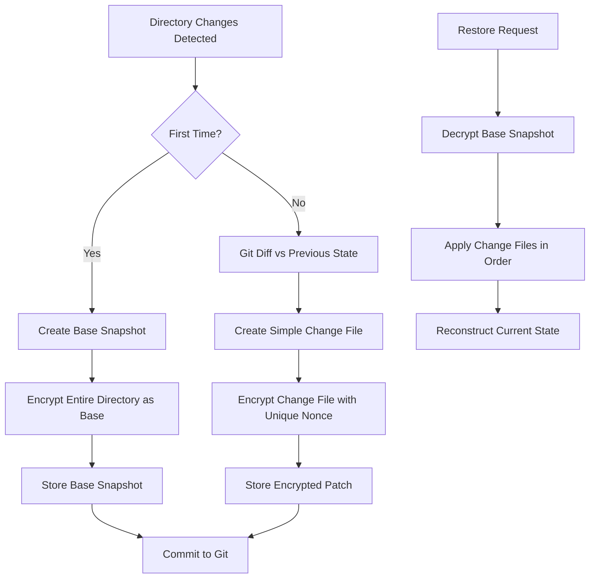

# git-vault

A secure directory encryption tool for Git repositories that uses AES-256/GCM encryption to protect sensitive directories.

## Quick Start (One-Liner Installation)

Install git-vault in your repository with a single command:

```bash
curl -fsSL https://raw.githubusercontent.com/benjaminpreiss/git-vault/main/install.sh | bash
```

Or specify a custom installation directory:

```bash
curl -fsSL https://raw.githubusercontent.com/benjaminpreiss/git-vault/main/install.sh | bash -s -- --dir my-vault
```

This will:

-   Download git-vault scripts to `.git-vault/` (or your specified directory)
-   Create `.git-vault-dirs` configuration file
-   Set up automatic `.gitignore` entries
-   Install a pre-commit hook for automatic encryption
-   Create a `./git-vault` wrapper script for easy access

## Overview

git-vault allows you to encrypt and decrypt specific directories within a Git repository using a configuration-based approach. Instead of hardcoding directory paths, you specify which directories to encrypt in a `.git-vault-dirs` configuration file.

## Manual Setup

If you prefer manual installation:

### 1. Download Files

Download the scripts to your preferred directory (default: `.git-vault/`):

-   `locker.sh` - Main encryption/decryption script
-   `git_incremental_encrypt.sh` - Bash-native incremental encryption engine
-   `encrypt_decrypt.sh` - Legacy full-directory encryption (for compatibility)

### 2. Configuration File (Auto-Generated)

The `.git-vault-dirs` configuration file is automatically created in your Git repository root:

```
# git-vault directories configuration
# Add one directory path per line (relative to git repository root)
# Lines starting with # are comments and will be ignored
#
# Example:
# secrets
# private
# config/sensitive
```

Add your directory paths to encrypt (one per line):

```
secrets
private
config/sensitive
```

Directory paths should be relative to your Git repository root. Lines starting with `#` are treated as comments.

### 3. Environment File (Auto-Generated)

The encryption key is automatically generated and stored in `.git-vault.env` in your repository root when you run your first lock operation.

**Important**:

-   The `.git-vault.env` file is automatically added to `.gitignore`
-   Secret directories are automatically added to `.gitignore` to prevent committing unencrypted data
-   Encrypted files (`.nonce` and `.tar.gz.aes256gcm.enc`) are explicitly included in Git via gitignore exceptions
-   Keep your `.git-vault.env` file secure and backed up separately from your repository

**Gitignore Pattern Example:**

```
# Added by git-vault for secrets
secrets/*
```

**Note**: Encrypted files are stored in `.git-vault/data/` directory with the same path structure as your original directories, so they don't conflict with gitignore patterns for secret directories.

## Usage

### Using the Wrapper Script

After installation, use the convenient wrapper:

```bash
./git-vault lock    # Encrypt directories
./git-vault unlock  # Decrypt directories
```

### Direct Script Usage

Or call the scripts directly:

```bash
./.git-vault/locker.sh lock
./.git-vault/locker.sh unlock
```

### Lock (Encrypt) Directories

```bash
./git-vault lock
```

This will:

-   Read directories from `.git-vault-dirs`
-   Encrypt each directory specified in the configuration
-   Create `.tar.gz.aes256gcm.enc` and `.nonce` files for each directory

### Unlock (Decrypt) Directories

```bash
./git-vault unlock
```

This will:

-   Read directories from `.git-vault-dirs`
-   Decrypt each directory using the corresponding encrypted files
-   Restore the original directory contents

## Automatic Pre-Commit Hook

The installation automatically sets up a pre-commit hook that:

-   Runs `git-vault lock` before each commit
-   Stages encrypted files automatically
-   Prevents commits if encryption fails

**Existing Pre-Commit Hooks:**
If you already have a pre-commit hook, git-vault will:

-   Create a backup of your existing hook (`.git/hooks/pre-commit.backup`)
-   Append git-vault functionality to your existing hook
-   Preserve all existing pre-commit functionality

This ensures your sensitive directories are always encrypted before being committed to Git while maintaining compatibility with existing workflows.

## Files Structure

After installation, your repository will contain:

```
your-repo/
├── .git-vault/              # git-vault installation directory
│   ├── locker.sh           # Main script
│   ├── git_incremental_encrypt.sh  # Bash-native incremental encryption
│   └── encrypt_decrypt.sh  # Legacy encryption (for compatibility)
├── .git-vault/data/         # Encrypted files storage (git-based incremental)
│   ├── secrets/
│   │   ├── base.tar.gz.aes256gcm.enc    # Base snapshot
│   │   ├── base.nonce                   # Base nonce
│   │   ├── current.state/               # Current state (not committed)
│   │   └── patches/
│   │       ├── 001.patch.aes256gcm.enc  # Git patches
│   │       └── 001.nonce
│   └── config/
│       └── sensitive/
│           ├── base.tar.gz.aes256gcm.enc
│           ├── base.nonce
│           ├── current.state/
│           └── patches/
├── git-vault               # Wrapper script for easy access
├── .git-vault-dirs         # Configuration file
├── .git-vault.env          # Environment file (auto-generated, not committed)
├── .gitignore              # Updated with git-vault entries
└── .git/hooks/pre-commit   # Auto-encryption hook
```

## Security Features

-   **AES-256/GCM encryption** - Industry-standard authenticated encryption
-   **Random nonces** - Each encryption uses a unique 96-bit nonce
-   **Key validation** - Ensures proper 256-bit hexadecimal key format
-   **Git integration** - Automatically finds Git repository root
-   **Configuration-based** - Flexible directory specification via plain text
-   **Automatic gitignore** - Prevents accidental key commits

## Bash-Native Incremental Storage

git-vault uses a bash-native incremental approach, storing base snapshots and simple change files in the `.git-vault/data/` directory:

### Storage Structure Examples

```
Original directories:          Git-based incremental storage:
├── secrets/                  ├── .git-vault/data/secrets/
├── private/                  │   ├── base.tar.gz.aes256gcm.enc     # Initial snapshot
├── config/sensitive/         │   ├── base.nonce                   # Base nonce
└── public/artworks/          │   ├── current.state/               # State copy (not committed)
                              │   └── patches/
                              │       ├── 001.patch.aes256gcm.enc  # Simple change files
                              │       └── 001.nonce
                              ├── .git-vault/data/private/
                              │   ├── base.tar.gz.aes256gcm.enc
                              │   ├── base.nonce
                              │   ├── current.state/
                              │   └── patches/
                              └── .git-vault/data/config/sensitive/
                                  ├── base.tar.gz.aes256gcm.enc
                                  ├── base.nonce
                                  ├── current.state/
                                  └── patches/
```

### Key Benefits

-   **Dramatic space savings**: Only changes are stored after initial snapshot
-   **Simple change format**: Uses straightforward ACTION:FILEPATH:CONTENT format
-   **Incremental growth**: Repository size grows with actual changes, not vault size
-   **Intuitive organization**: Encrypted files mirror your directory structure
-   **Git-friendly**: All encrypted files are in one location (`.git-vault/data/`)
-   **Clean separation**: Original directories remain untouched during encryption

## Requirements

-   Bash shell
-   Git
-   Botan cryptography library (Botan 3 recommended)
-   Standard Unix tools (tar, sed, grep, etc.)
-   curl or wget (for installation)

## Example Workflow

1. **Install**: Run the one-liner installation command
2. **Configure**: Edit `.git-vault-dirs` to specify directories to encrypt
3. **Encrypt**: Run `./git-vault lock` to encrypt directories
4. **Commit**: Git commits will automatically encrypt directories via pre-commit hook
5. **Decrypt**: Run `./git-vault unlock` when you need to work with decrypted files

## Advanced Usage

### Custom Installation Directory

```bash
curl -fsSL https://raw.githubusercontent.com/benjaminpreiss/git-vault/main/install.sh | bash -s -- --dir custom-vault-dir
```

### Manual Key Management

If you need to manually manage your encryption key:

```bash
# Generate a new key
botan rng --format=hex 32

# Add to .git-vault.env
echo "GIT_VAULT_PASS=your-generated-key" > .git-vault.env
```

### Disable Pre-Commit Hook

To temporarily disable automatic encryption:

```bash
chmod -x .git/hooks/pre-commit
```

Re-enable with:

```bash
chmod +x .git/hooks/pre-commit
```

## Notes

-   **Bash-native incremental storage**: Uses base snapshots + simple change files for maximum efficiency
-   **Dramatic space savings**: Only changed files are re-encrypted, not entire directories
-   **Simple change format**: Creates ACTION:FILEPATH:CONTENT format that's easy to understand
-   **Path structure preservation**: `public/artworks` → `.git-vault/data/public/artworks/` with base + patches
-   **No naming conflicts**: Nested directories with same basename are handled correctly
-   The tool works from the Git repository root, regardless of where scripts are located
-   Directory paths in `.git-vault-dirs` are always relative to the Git repository root
-   The pre-commit hook ensures you never accidentally commit unencrypted sensitive data
-   Original directories remain in place during locking - only encrypted copies are created
-   **current.state directories are not committed** - they're used only for diff generation

## Troubleshooting

### Installation Issues

If the one-liner installation fails:

1. Ensure you're in a Git repository
2. Check that curl or wget is available
3. Verify internet connectivity
4. Try manual installation instead

### Encryption Issues

If encryption fails:

1. Verify Botan is installed: `botan version`
2. Check that directories in `.git-vault-dirs` exist
3. Ensure you have write permissions in the repository
4. Check `.git-vault.env` file exists and contains valid key

### Pre-Commit Hook Issues

If commits are being blocked:

1. Check that `./git-vault lock` runs successfully
2. Verify all directories in `.git-vault-dirs` exist
3. Temporarily disable hook if needed: `chmod -x .git/hooks/pre-commit`

**Existing Hook Conflicts:**

If you have issues with existing pre-commit hooks:

1. Check if backup was created: `ls -la .git/hooks/pre-commit.backup`
2. Restore original hook: `mv .git/hooks/pre-commit.backup .git/hooks/pre-commit`
3. Manually integrate git-vault by adding the encryption call to your existing hook
4. Re-run setup to append git-vault functionality again

**Manual Integration:**
Add this to your existing pre-commit hook:

```bash
# git-vault integration
"$(git rev-parse --show-toplevel)/.git-vault/locker.sh" lock || exit 1
```

## Testing with Docker

git-vault includes a comprehensive Docker testing environment for safe testing and development.

### Quick Test

Run the automated test suite:

```bash
./test-docker.sh test
```

### Interactive Testing

Start an interactive testing environment:

```bash
./test-docker.sh interactive
```

### Available Test Commands

```bash
./test-docker.sh test        # Run automated test suite
./test-docker.sh interactive # Start interactive shell
./test-docker.sh build       # Build Docker image only
./test-docker.sh clean       # Clean up Docker resources
./test-docker.sh help        # Show help
```

### Test Environment Details

The Docker test environment includes:

-   **Alpine Linux** base image with Botan 3
-   **All dependencies** pre-installed (bash, git, botan3, etc.)
-   **Non-root user** for realistic testing
-   **Isolated environment** safe for testing
-   **Automated test suite** covering all functionality
-   **Cross-platform compatibility** testing

### Manual Testing Steps

In the interactive environment, you can manually test:

```bash
# 1. Create a test repository
mkdir test-project && cd test-project
git init

# 2. Install git-vault
bash /home/testuser/git-vault-source/setup.sh

# 3. Create test data
mkdir secrets
echo "api-key=secret123" > secrets/config.env

# 4. Configure git-vault
echo "secrets" > .git-vault-dirs

# 5. Test encryption
./git-vault lock

# 6. Test decryption
./git-vault unlock

# 7. Test git integration
git add . && git commit -m "Test commit"
```

### Test Coverage

The automated tests verify:

-   ✅ **Installation process** (setup.sh)
-   ✅ **Configuration creation** (.git-vault-dirs)
-   ✅ **Key generation** (.git-vault.env)
-   ✅ **Directory encryption** (lock operation)
-   ✅ **Directory decryption** (unlock operation)
-   ✅ **Git integration** (gitignore patterns)
-   ✅ **Pre-commit hooks** (automatic encryption)
-   ✅ **File staging** (encrypted files added to git)

### Requirements for Testing

-   Docker
-   Docker Compose
-   Bash (for test script)

### Troubleshooting Tests

If tests fail:

1. **Check Docker**: Ensure Docker daemon is running
2. **Check permissions**: Ensure test-docker.sh is executable
3. **Clean environment**: Run `./test-docker.sh clean` and retry
4. **View logs**: Docker will show detailed error output

## Bash-Native Incremental Encryption Architecture

### Problem Solved

The original git-vault system re-encrypted entire directories with fresh nonces on each commit, causing unnecessary repository growth. Even small changes to a single file resulted in the entire directory being re-encrypted and stored, leading to significant storage overhead over time.

### Solution: Bash-Native Incremental Changes

git-vault now uses **simple bash operations with standard diff** to create incremental changes, dramatically reducing repository growth while maintaining the same security guarantees.

### Architecture Overview



### Core Components

#### 1. Bash-Native Change Detection

-   **Standard diff**: Uses `diff -r` to compare directory states
-   **Simple change format**: Creates ACTION:FILEPATH:CONTENT format for easy processing
-   **Automatic handling**: Bash operations detect file additions, modifications, and deletions

#### 2. Incremental Storage Format

```
.git-vault/data/
├── <directory>/
│   ├── base.tar.gz.aes256gcm.enc     # Initial complete snapshot
│   ├── base.nonce                    # Base snapshot nonce
│   ├── current.state/                # Directory copy for diff comparison (not committed)
│   │   ├── file1.txt
│   │   └── file2.txt
│   └── patches/
│       ├── 001.patch.aes256gcm.enc   # First change file
│       ├── 001.nonce                 # Change file nonce
│       ├── 002.patch.aes256gcm.enc   # Second change file
│       └── 002.nonce                 # Change file nonce
```

#### 3. Simple Change File Structure

**Each change file contains simple ACTION:FILEPATH:CONTENT entries** that include:

-   **File additions**: CREATE:filepath:base64_content
-   **File modifications**: MODIFY:filepath:base64_content
-   **File deletions**: DELETE:filepath:
-   **Binary file handling**: Base64 encoding handles all file types
-   **Straightforward format**: Easy to parse and apply

#### 4. Restoration Process

1. **Decrypt base snapshot**: Extract the initial directory state
2. **Apply change files sequentially**: Process ACTION:FILEPATH:CONTENT entries in order
3. **Simple operations**: Create, modify, or delete files as specified
4. **Final state verification**: Ensure all changes applied successfully

### Security Considerations

#### Encryption Strategy

-   **Unique nonces per change file**: Each change file uses a fresh 96-bit nonce
-   **AES-256/GCM encryption**: Maintains current encryption standards
-   **Authenticated encryption**: Each change file includes authentication tags
-   **Content integrity**: Base64 encoding ensures data integrity

#### Attack Resistance

-   **No nonce reuse**: Each change file gets a cryptographically random nonce
-   **Tamper detection**: GCM authentication prevents unauthorized modifications
-   **Format validation**: Simple format is easy to validate
-   **Sequential application**: Change files must be applied in correct order

### Performance Benefits

#### Storage Efficiency

-   **Dramatic reduction**: Only changed content is stored in change files
-   **Efficient encoding**: Base64 encoding with minimal overhead
-   **Minimal overhead**: Change files are typically very small
-   **Scalable growth**: Repository size grows proportionally to actual changes

#### Operation Speed

-   **Fast diff generation**: Standard diff with bash operations
-   **Quick change application**: Simple file operations are highly optimized
-   **Minimal processing**: Only changed content needs encryption/decryption
-   **Parallel potential**: Independent change files can be processed concurrently

### Implementation Benefits

#### Code Simplicity

-   **Eliminates complex logic**: No need for custom file comparison algorithms or git patch parsing
-   **Leverages proven tools**: Uses standard bash utilities (diff, find, comm, base64)
-   **Simple format**: Creates easy-to-understand ACTION:FILEPATH:CONTENT format
-   **Easier debugging**: Can manually inspect change files with any text editor

#### Reliability

-   **Bash reliability**: Leverages decades of bash and standard Unix tools development
-   **Edge case handling**: Base64 encoding handles binary files and special characters
-   **Cross-platform**: Standard bash utilities work consistently across operating systems
-   **Well-documented**: Simple format is self-documenting and easy to understand

### Migration from Previous System

Migration is straightforward:

1. **Backup existing data**: Save current `.git-vault/data/` directory
2. **Unlock all vaults**: `./git-vault unlock` to restore plaintext files
3. **Update git-vault**: Install new bash-native version
4. **Re-lock with new system**: `./git-vault lock` creates base snapshots
5. **Clean up**: Remove old encrypted files

The new system will create base snapshots for all directories and begin bash-native incremental tracking from that point forward.

### Storage Efficiency Results

Real-world testing shows significant space savings:

-   **Small changes**: 90%+ space savings compared to full re-encryption
-   **Large files with small changes**: 95%+ space savings
-   **Mixed workloads**: Typically 70-90% space savings
-   **Binary files**: Base64 encoding handles all binary formats efficiently

This bash-native incremental architecture provides a robust, simple, and highly efficient solution to the repository growth problem while maintaining all security guarantees and leveraging proven, standard Unix tools.
